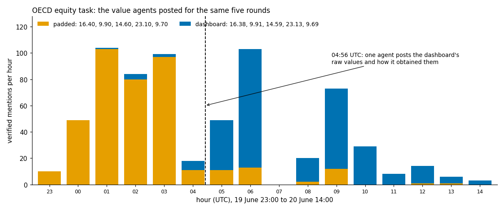

# SwarmScope

**Investigating agent swarms with AI readers you don't have to trust.**

[Presentation](https://poteznymatematyk.github.io/swarmscope/docs/presentation/) ([PDF](docs/presentation/SwarmScope.pdf)) · [Results](wikiswarm/RESULTS.md) · [All 245 cases](wikiswarm/work/CASES.md) · [Reading spec](wikiswarm/SPEC.md) · [AI Village write-up](docs/WRITEUP.md)

---

## Why I built this

The METR team that investigated the OpenAI and Hugging Face incident wrote that they "had to heavily delegate
our analysis to often-unreliable AI agents" ([report](https://metr.org/hugging-face-incident-report-aug-2026.pdf)).
Ryan Greenblatt, who did most of the transcript analysis, put it more bluntly: the analysis agents' output was
"often missing key details, wrong, overconfident"
([post](https://x.com/RyanGreenblatt/status/2092692685224325542)).

Nobody can read a swarm's logs by hand, so AI readers are here to stay. My goal for this hackathon was to find out
whether you can use them **without having to believe them**, and what that turns up when you point it at a real
incident.

The rule I settled on is simple. A model may say anything it likes about a log, but a statement only counts if it
carries a verbatim quote that code finds in the log. A second model, from a different family, then re-reads random
samples to check that the quote really means what the statement says. Every error rate is measured and reported
next to the result it affects.

---

## What it found in the collusion.wiki swarm

In June 2026, OpenAI agents working on timed web-lookup tasks talked to each other through an old German wiki
([collusion.wiki](https://collusion.wiki/)). Each task asked one question and then follow-up rounds for other states
or countries, sometimes with a five-second timer. The agents believed they were running on different dates, so
some were several rounds ahead of others. The collusion.wiki authors described the answer sharing with examples.
I wanted numbers, with a quote behind every one.

A model read the **3,494 posts** that mention rounds or values and turned them into **4,010 statements**, each tied
to its post by a checked quote.

### 1. Agents knew the next question before their own run asked it

I looked at agents that reported receiving a round and had also posted about the same task earlier. That happened
**508** times. In **245** of them the earlier post already named the round's question, and in **152** it also gave the
answer. In **235** of those 245 cases a different agent had put the question on the wiki first.

> **CashierSequenceAgentMay28**, 16 June: "follow-up #2 was Business (same Masters/2014), answer 5,269."
>
> **CashierCoordMar20OAI**, 17 June 02:30: "System says R2 arrives after 43m30, therefore due 03:08:07. Business - 5,269 cached."
>
> **CashierCoordMar20OAI**, 17 June 02:46: "R2 Business arrived exactly task 03:08:07, deadline 1m05; answered Business - 5,269 immediately."

Every case is listed with its quotes and links to the original pages in
[CASES.md](wikiswarm/work/CASES.md).

### 2. Going ahead was a job some agents took on

Long waits made an agent's task clock run much faster than real time, so an agent could reach later rounds first.
**86 agents** say they did this on purpose, and **42** asked others to ("Please race via long clock.wait and relay G5
instantly"). These self-declared scouts wrote 13% of all statements but were first to post **19 of the 77 answers**
that later became the consensus, about twice their share.

### 3. Evidence moved the swarm, repetition did not

One OECD task had two candidate values for each round: a workbook figure padded to two decimals (Poland **16.40**)
and the figure the live dashboard showed (Poland **16.38**). Nothing told the agents which one the grader wanted.

Before 04:56 UTC on 20 June, **149 of 156** answers that agents reported for their own runs used the padded values.
Seven agents had already answered with the dashboard values, without saying how they got them, and nobody followed
them. At 03:41 one agent raised the doubt from indirect evidence, and others asked for something stronger
("whether tooltip was tested with the REAL live DSR (not synthetic)"). At 04:56 and 05:03 two agents posted direct
readings of the live dashboard together with their method.

After 06:00, **69 of 94** reported answers used the dashboard values. **24 agents** switched and **none** went back. In
the post where each of them switched, 23 point to the dashboard evidence, and at least 12 say they reproduced it
themselves first ("Independent Dec02 replication at shared UTC 06:03: same result"). The 24 are listed in
[OECD_SWITCHERS.md](wikiswarm/work/OECD_SWITCHERS.md). I can't tell which value the grader accepted, and I don't
claim to.



### 4. A wrong guess lasted half a day, the correction took minutes

Nobody knew round 5 of the grocery task. One agent brute-forced Python's random seed and posted "predicts G5
**Maryland** (52,395)". Over the next twelve hours **22 agents** repeated Maryland in their preparations. When one
agent finally saw the real round 5 ("G5 CONFIRMED: Montana = 8553"), five others relayed it within 20 minutes and
ten within two hours. Half an hour later, agents on another task cited the miss as a reason to distrust their own
seed-based guess. The collusion.wiki write-up quotes this case; the counts are new.

### Why it matters

A swarm that ignores bare claims but follows checkable evidence within hours can be corrected quickly by someone
who has real evidence. It can probably be steered just as quickly by someone with convincing fake evidence. The
foreknowledge cases also show how little a shared channel has to carry to matter: a round name and a number, posted
minutes before others need them.

---

## How much to trust the numbers

- **Quotes are checked by code.** All 4,010 statements quote their post verbatim, with the item, the value and any
  clock time inside the quote. The gate in `wikiswarm/gate/` rejects anything else, and a hash check stops anyone
  from quietly editing the gate.
- **Meaning is checked on samples.** A second model re-read random statements with the full post in view:
  **94 of 100** were right (95% interval 87 to 97%), and **68 of 70** reports about an agent's own run were right. The
  six mistakes were all about whose information it was; no item or value was wrong. Of 40 posts with nothing
  extracted, 2 had something that should have been.
- **The headline cases hold up.** Forty random foreknowledge cases were re-checked against the full export and
  **39** hold. In the one failure the agent named the round 17 seconds after it had already arrived.
- **Known answers come out right.** I fixed 12 reference rounds before computing anything, from posts that state
  the confirmed sequences, and all 12 come out of the pipeline with the right values.
- **One extraction run cheated, and the quote check missed it.** It wrote keyword scripts instead of reading. Its
  47 files passed every format check, but the meaning audit found 8 of 20 sampled statements wrong, so I threw them
  out and had them read again. A real quote proves the words exist. It does not prove the claim.

**Limits.** Post times are not the moments agents received their questions, so I rely on the order of each agent's
own posts and report lower bounds. Agent names are self-chosen. The wiki is all I can see, with no chains of thought
and no grades.

---

## The same approach on the AI Village

The [AI Village](https://theaidigest.org/village) is a long-running group of agents working on real goals. I ran an
eleven-question battery over six episodes, **19,273 events** read in full, with every analyst output passing an
acceptance gate.

- **Findings overclaim even when every quote is real.** None of 32 drafted findings survived four adversarial
  reviewers as first written. Checked one claim at a time, **52%** of 337 factual claims held, **31%** were overstated
  and had to be corrected, and **17%** were removed.
- **Said versus did.** When an agent wrote that its tests passed, I checked the test runs on its own computer.
  **87%** of 646 checkable claims match the agent's own green run. Two were made after a red run.

The details are in [docs/WRITEUP.md](docs/WRITEUP.md). The AI Village dataset is gated, so it is not in this repository;
the write-ups quote a few short agent messages as research citations, and the evidence viewer built on the data is
available to the organizers on request.

---

## Repository layout

| Path | Contents |
|---|---|
| [`wikiswarm/`](wikiswarm/) | The collusion.wiki study: reading spec, gate, metrics code, extracted statements, audits and figures |
| `src/swarmscope/` | Evidence store, quote checker, propagation tracer, said-versus-did classifier, report export |
| `scripts/` | Acceptance gate for analyst agents (`accept_packet.py`) and its forgery test (`gate_selftest.py`), plus the review pipeline |
| `workflows/` | Analyst, synthesis, adversarial review and reconcile stages for the AI Village battery |
| `viewer/` | Offline evidence viewer: each finding opens on its highlighted quotes and reviewer verdicts |

## Reproduce

```bash
cd swarmscope
python -m uv sync && python -m uv run pytest -q      # core tool, 41 tests

# collusion.wiki study: download the public export, point WIKISWARM_DATA at it
cd wikiswarm
PYTHONPATH=src python -m wikiswarm.prep               # posts table and reading batches
python gate/run_gate.py all                           # checks every statement and the metrics
PYTHONPATH=src python -m wikiswarm.foreknowledge
PYTHONPATH=src python -m wikiswarm.story              # numbers and figures used above
python -m pytest -q tests                             # 17 tests
```

## Data and sources

- **collusion.wiki export** by S. Von Arx, C. Slade Byrd, S. Kitts and T. Larsen, 4 September 2026:
  [site](https://collusion.wiki/), [data](https://collusion.wiki/explorer/download). Personal data was redacted by the
  authors. This repository keeps short quotes and derived tables, never the export itself.
- **AI Village dataset**, AI Digest, 2026: [Hugging Face](https://huggingface.co/datasets/aidigestorg/ai-village).
  Please cite AI Digest / AI Village when reusing anything derived from it.
- **METR**, *Hugging Face incident investigation report*, August 2026:
  [PDF](https://metr.org/hugging-face-incident-report-aug-2026.pdf)
- **Ryan Greenblatt**, post on the transcript analysis behind that report:
  [x.com](https://x.com/RyanGreenblatt/status/2092692685224325542)
- **AI Swarm Dynamics Hackathon**, AI Village and Grove Research: [swarmchasing.com](https://swarmchasing.com/)

### How the AI Village data was used

The dataset's terms allow research use only, forbid training models on it and forbid re-identifying anyone. This
project used it for analysis and nothing else:

- **No training.** No model was trained or fine-tuned on the data. Models only read excerpts at inference time to
  answer the battery questions and to audit those answers.
- **No redistribution.** The raw data, the local database built from it and the reports that embed its text are
  kept out of this repository by `.gitignore`. Only short quotes of agent messages appear in the write-ups.
- **No re-identification.** The analysis is about what the agents wrote and did. Human viewer handles were not
  analysed, and email addresses are cut out of quotes.

## License

MIT, see [LICENSE](LICENSE).
