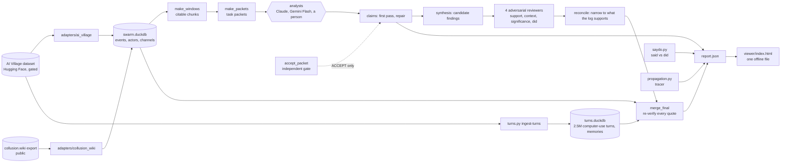

# Architecture

SwarmScope separates **what a model may say** from **what code has checked**. Models read, summarise and judge; code decides whether a quote exists,
whether an analyst really read the chunk, whether a test claim matches what the agent ran. A claim reaches the viewer only if it carries an
`(event ref, verbatim quote)` pair that the checker found in the log.

## Where models are trusted, and where they are not

| step | who does it | what is checked by code |
|---|---|---|
| read a chunk, write claims | analyst model or person | every quote must occur verbatim, contiguous, on word boundaries in the cited event (`evidence.py`); counted claims cite one event per instance; named actors must appear in the evidence (`claims.py`) |
| prove the chunk was read | analyst | reading receipts with event handles that must lie inside each slice, evidence spread over at least four of five parts of the chunk, immutable first pass, at most 25% deletions, logged repairs (`scripts/accept_packet.py`) |
| synthesize findings | model | `swarmscope verify-findings`: every quote of every evidence item |
| review and reconcile | models | `scripts/merge_final.py` re-verifies every quote of the final version against the log and the turns database |
| semantic audit | separate model | the audit only measures, it never changes a claim |
| said vs did | code only | `saydo.py` parses the test runs an agent executed and classifies each chat claim; precision of each category is measured by skeptic review |
| propagation | code only | `propagation.py` finds strings that spread between agents; every hop is re-verified like a quote |

The operator never relies on a worker's own report: `scripts/accept_all.py` re-runs the gate over every output folder, and a tripwire fingerprints
the frozen tool, the episode windows, the protocol and the gate itself, so a worker that edits its own checker is rejected.

## Data model

`schema.py` defines `Event` (id, source, timestamp, actor, channel, type, subtype, text, raw reference), `Actor` and `Channel`; every adapter maps its
source onto them, so the battery, the tracer and the viewer never see source-specific fields. Events are cited by a 10-hex handle (`ref_of`), turns of the
computer-use layer likewise. `store.py` keeps the events in DuckDB; `turns.py` ingests the 2.5 million computer-use turns into a slim projection
(first and last 600 characters of each output, no raw model messages) so that "what the agent ran" is queryable in seconds.

## Modules

| module | purpose |
|---|---|
| `adapters/ai_village.py`, `adapters/collusion_wiki.py` | raw files to the unified schema |
| `evidence.py`, `claims.py` | deterministic citation checking, batch verification of claims |
| `export.py` | compact one-line-per-event transcripts that a model or a person can read and cite |
| `propagation.py` | tracer for strings that spread between actors, with lag and adopter statistics |
| `turns.py`, `saydo.py` | layer C (what agents executed) and the said-vs-did audit of test claims |
| `report.py` | assembles `report.json`, the single contract between analysis and viewer; re-verifies all evidence |
| `viewer/index.html`, `viewer/embed.py` | offline evidence viewer (no network, untrusted text rendered as text only) |
| `scripts/` | task packets, acceptance gate, operator sweep, workflow glue, report assembly |
| `workflows/battery_v2.mjs` | the multi-agent workflow (see `workflows/README.md`) |

## Tests

`python -m uv run pytest -q` runs 41 tests on small synthetic fixtures: citation checking, claim verification, the adapters, the tracer, the turns
ingest, the test-output parsers and the claim parser of the said-vs-did classifier (including regressions found by skeptic review), report assembly and
the viewer embedding (hostile text must not break out of the embedded data). The acceptance gate was self-tested against an honest packet and ten
lazy-worker mutations (forged reading receipts, copied quotes, padded claims, deleted claims, edited first pass, ...); it accepted the honest one and
rejected all ten.
